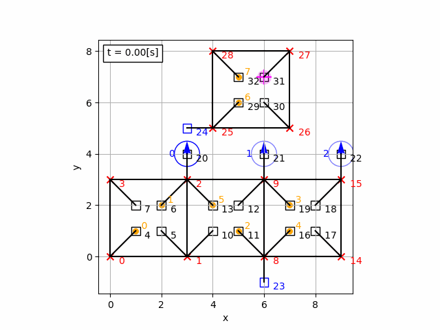

# Classical Planning Project for Warehouse management

created as part of course 097244 - Cognitive Robots at the Technion

plainly speaking:
* packages need to be delivered from one house to the other
* a robot can pick up and drop packages.
* a robot can carry up to 1 package at a time
* robots are not allowed to intersect or occupy the same location
* robots have limited charge, depleting with distance traveled (drawn blue circle gets weaker)
* robots can recharge at a dock (marked by a blue square)
* drones can pick up robots that carry no packages and drop them at unoccupied docks
* drones and robots have different velocities
* we minimize make-span

## aknowledgements
* the great people who developed OPTIC, tamer, lpg-td and other solvers.
* AIPlan4EU at: https://github.com/aiplan4eu/unified-planning




# Installation
developed with python 3.9.12 </br>
you may have to install solvers from https://github.com/aiplan4eu if using unified planning solvers (tamer specifically)
```
$ conda create --name maildelivery python=3.9
$ conda activate maildelivery
$ git clone https://github.com/AlonSpinner/maildelivery
$ cd maildelivery
$ pip install -r requirements.txt 
$ pip install .
```

# Playing Around
run the test files in the test folder </br>
tests ending with 'problem' are the interesting ones </br>
test number 17 (replanning) was abandoned at this hour </br>

```
$ cd tests
$ python 08_problem_3.py
```
You can possibly find better plans for the problems by having the lpg solver look for more solutions.
This can by done by changing the "lpg_n" parameter when calling planner.solve()
Try not to ask for too many different soltuions when such don't exist.

